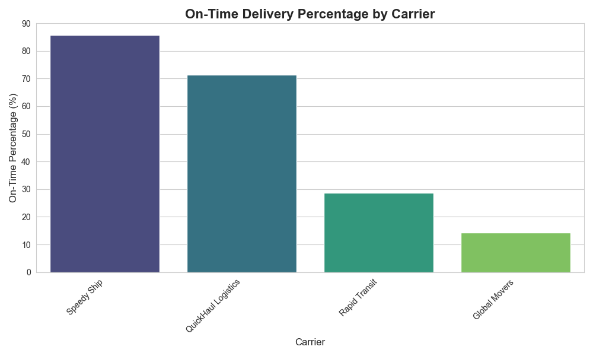
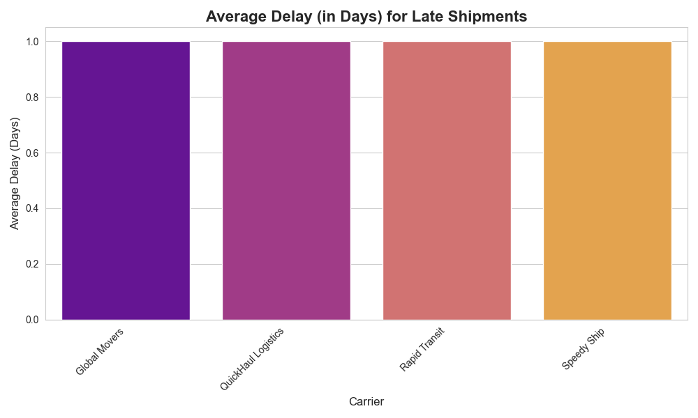
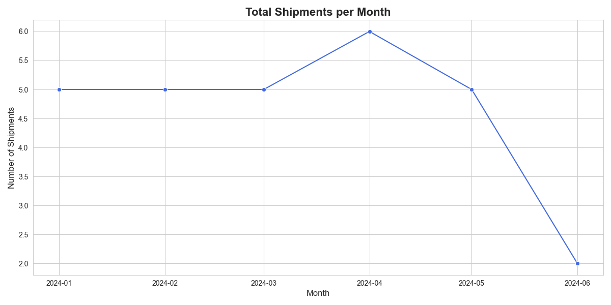

# Transportation Carrier Performance Visualization

## Overview

This project analyzes carrier shipping data from a CSV file to derive key performance metrics. It uses Python with the pandas library for data manipulation and Matplotlib/Seaborn for generating visualizations. The script calculates on-time delivery percentages, average delay times for late shipments, and shipment volume over time, saving the output as PNG image files.

---

## Features

- **Data Loading:** Loads data from a CSV file into a pandas DataFrame.
- **Feature Engineering:** Calculates new data points like `delay_days` and a boolean `on_time` status for each shipment.
- **Performance Metrics:**
  - Calculates the on-time delivery percentage for each carrier.
  - Calculates the average delay in days for shipments that were not on time.
  - Aggregates total shipments by month to show trends.
- **Data Visualization:** Generates and saves three key visualizations.

---

## Sample Visualizations

Here are the charts generated by the script:

### On-Time Delivery Percentage by Carrier

### Average Delay for Late Shipments

### Monthly Shipment Volume

**Project Journey & Debugging Summary**
_This project also served as a practical exercise in debugging common development issues. The initial script was functional, but several environmental and workflow-related challenges had to be overcome:_

**Command-Line Navigation:** An initial hurdle involved navigating into the project directory from the terminal due to a hidden trailing space in the folder's name. This was resolved by using a wildcard (cd transportation-visualization-project*) and highlighted the importance of clean naming conventions.

**Script Execution Issues:** The primary challenge was that the script would execute without producing any output or errors. Through a systematic process of elimination, we discovered that the Python file being executed (visualize_performance.py) was not being saved correctly from the Atom text editor, resulting in a blank file being run by the Python interpreter.

**Resolution:** The problem was solved by verifying the file's contents using the cat command in the terminal, which confirmed it was empty. The correct code was then pasted into a standard text editor, saved properly, and executed successfully, finally generating the expected visualizations.
